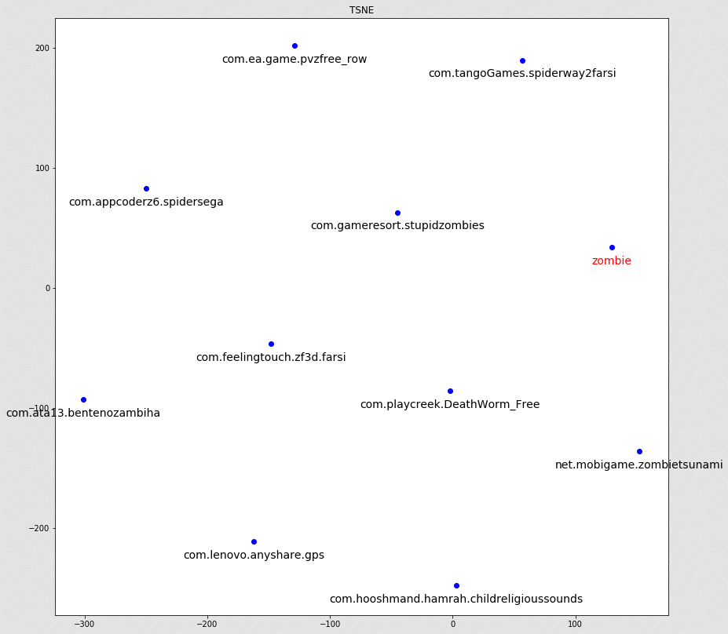

# sponsored-search
This repository contains implementation of a simple sponsored search advertising model 
for generating desired embeddings from queries and ads in the same representation space.

<div style="text-align:center">
<p>
    
</p>
    <em>Visualized example using t-distributed stochastic neighbor embedding</em>
</div>

## Pre-requisite Installation
### With pip
```bash
pip install transformers
```
 ### With conda
```shell script
conda install -c huggingface transformers
```
 
 ## Running
 ### Training
Sample notebook is available in [query_ad.ipynb](query_ad.ipynb)
 ### Prediction Server
 Make sure following files are in the "representations" directory
 ```
project
│── 📂 representations
│   └── 📜 ad_id_to_package.pkl
│   └── 📜 ad_reprs.pt
│   └── 📜 vocab_reprs.pt
└── ...
```
 ```shell script
$ python3 src/server/server.py
```
⚠ First request might be slow due to loading required files.
##### API
 ```shell script
http://127.0.0.1:5000/predict?query="<string>"
```
##### Visual Interface
 ```shell script
http://127.0.0.1:5000/predict/visual?query="<string>"&k=<integer>
```


 
 ## Implementation Process
* Study the [paper](https://arxiv.org/pdf/1607.01869.pdf) and related material
* Create negative sampled dataset from the raw dataset
* Implement DatasetHandler for processing the data
* Implement Pytorch model in a multi-file manner
* Implement proper tests for ensuring integrity

#### Model Details
The main module implemented for building representations is as follows.
```shell script
QueryAdCoordinator(
  (query_representation_builder): RepresentationBuilder(
    (embedding): Embedding(100000, embedding_dim)
    (pooling_module): SpanPoolingAvg()
  )
  (ad_representation_builder): RepresentationBuilder(
    (embedding): Embedding(93592, embedding_dim)
    (pooling_module): SpanPoolingAvg()
  )
  (loss): CosineEmbeddingLoss()
)
```

## TODO
* Implement alternative method with [word2vec skip-gram negative sampling](https://github.com/LakheyM/word2vec/blob/master/word2vec_SGNS_git.ipynb)